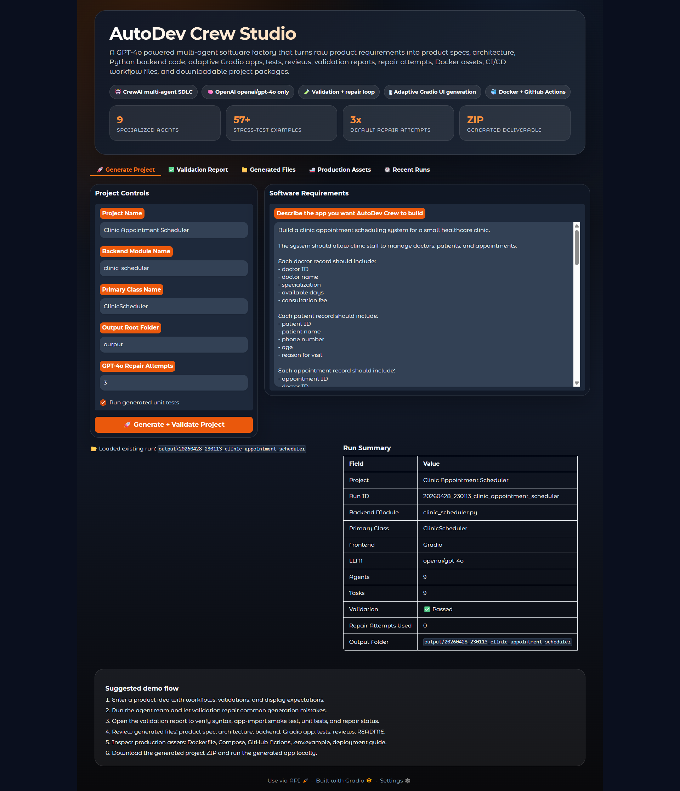
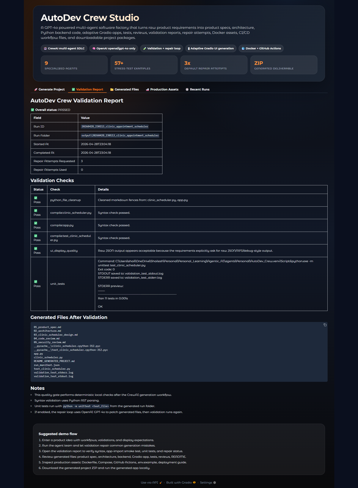
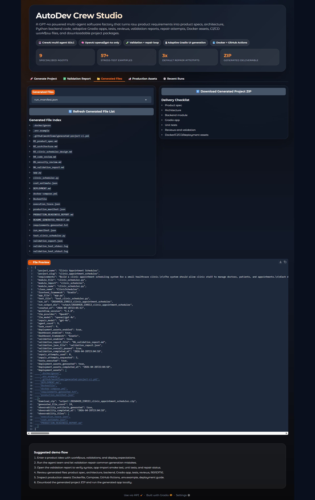
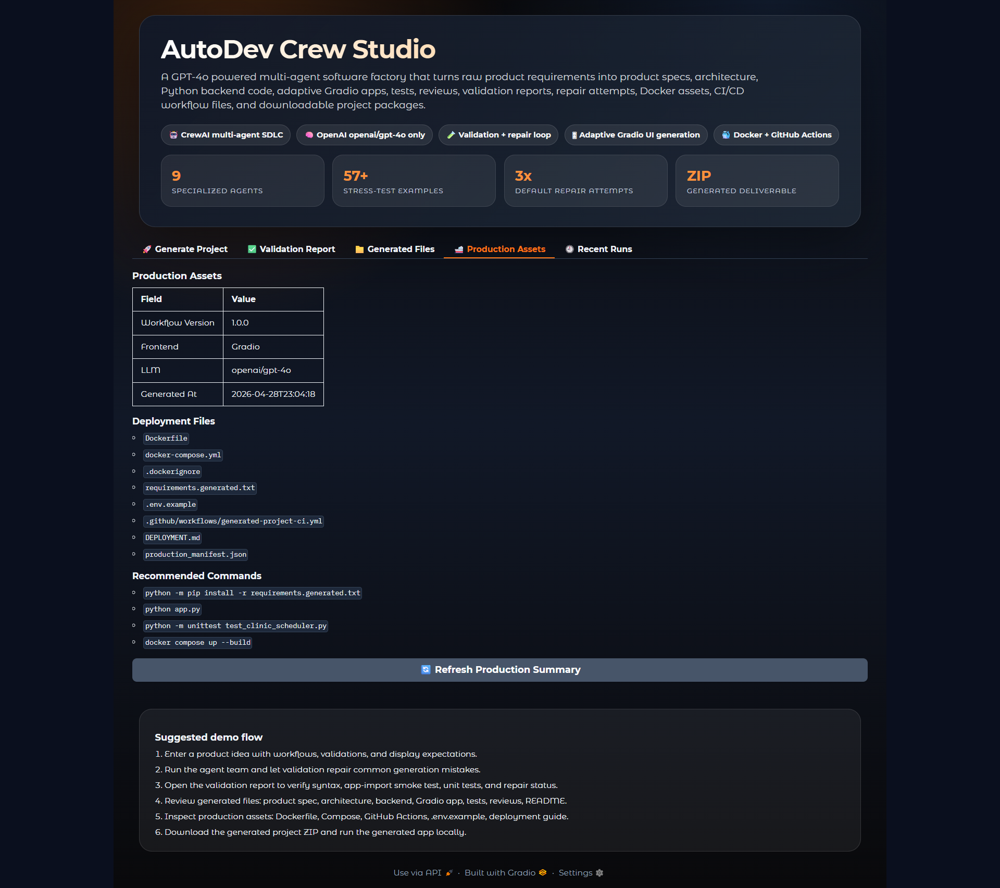
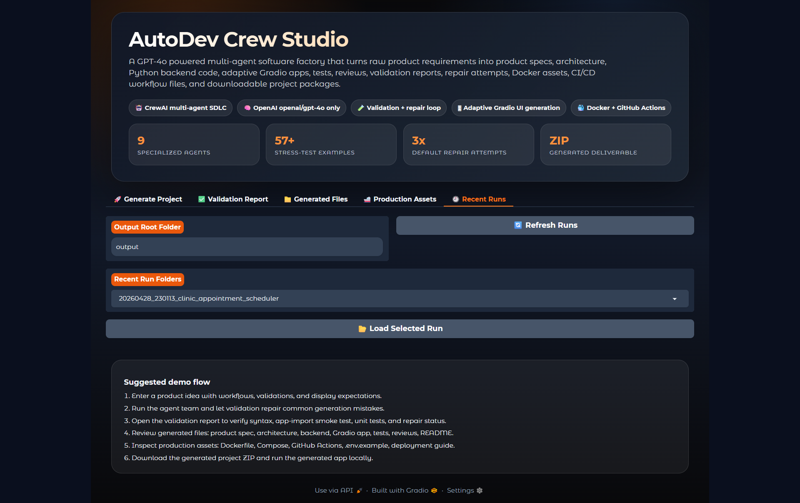

# 🚀 AutoDev Crew — Agentic AI Software Engineering Studio


**Repository:** [https://github.com/sg2499/AutoDev-Crew](https://github.com/sg2499/AutoDev-Crew)

---

## 📌 What is AutoDev Crew?

**AutoDev Crew** is an **Agentic AI Software Engineering Studio** that transforms natural-language software requirements into working software project artifacts.

Instead of manually asking an LLM to generate one file at a time, AutoDev Crew uses a structured multi-agent SDLC workflow to generate:

- Product specification
- Software architecture
- Backend Python module
- Adaptive Gradio application
- Unit tests
- Code review notes
- Security review notes
- Validation report
- Production-readiness report
- Dockerfile
- Docker Compose setup
- GitHub Actions workflow
- Deployment guide
- Downloadable generated project ZIP

The goal is to demonstrate how an AI engineering team can be simulated using specialized agents, validation gates, repair loops, and deterministic fallback logic.

AutoDev Crew is built as a **portfolio-grade AI product**, not just a notebook or one-off script.

---

## 🌱 Important Note — Please Learn From This, Do Not Blindly Copy It

> **I strongly do not recommend copying this entire project as-is and presenting it as your own work.**

AutoDev Crew is shared as a learning-focused, portfolio-grade reference project. The intention behind this repository is not to encourage copy-paste cloning, but to help developers, students, AI enthusiasts, and builders understand how an agentic AI software-generation product can be designed, structured, validated, and improved.

Please use this project to learn:

- How multi-agent AI systems can be structured,
- How CrewAI agents can collaborate on software-development tasks,
- How validation and repair loops can improve generated outputs,
- How Gradio can be used to build interactive AI product dashboards,
- How OpenAI GPT-4o can power agentic workflows,
- How production assets like Docker, GitHub Actions, reports, and deployment files can be generated,
- And how to think like an AI product builder instead of only a prompt user.

The best way to use this repository is to study the architecture, understand the decisions, identify what can be improved, and then build your **own version** with your **own ideas, workflows, branding, improvements, and use cases**.

That is where real learning happens.

If this project helps you understand agentic AI, build your own AI product, improve your portfolio, or take one step forward in your AI engineering journey, I would be genuinely happy. The purpose of sharing this work is to impart knowledge, help others grow, and encourage more people to build meaningful AI products in their own way.

> **Take inspiration. Learn deeply. Build independently. Improve boldly. Make it yours.**

---

## ⚠️ Mandatory OpenAI API Key Notice

AutoDev Crew uses **OpenAI GPT-4o under the hood** for agent reasoning, planning, code generation, reviews, documentation, validation repair, and project generation.

Because this product uses OpenAI models, users must provide their **own OpenAI API key** before generating projects.

This is mandatory.

Without a valid OpenAI API key, the dashboard will not allow generation to proceed.

### Why is the user’s own OpenAI API key required?

AutoDev Crew can make multiple LLM calls during a single generation workflow. A single run may involve:

- Product Manager Agent
- Solution Architect Agent
- Engineering Lead Agent
- Backend Engineer Agent
- Frontend Engineer Agent
- Test Engineer Agent
- Code Reviewer Agent
- Security Reviewer Agent
- Documentation Agent
- Validation and repair logic

If this product is deployed publicly and allowed to run using the owner’s private API key, random users could consume the owner’s OpenAI credits very quickly.

Requiring users to provide their own OpenAI API key:

- Prevents uncontrolled API spending by the project owner
- Keeps the public demo safer
- Allows serious users to test the product using their own credits
- Makes the product more scalable as a public portfolio demo
- Prevents accidental abuse of the owner’s private OpenAI quota
- Encourages responsible AI usage

### Important API provider note

AutoDev Crew is configured to use:

```text
openai/gpt-4o
```

So users must provide an **OpenAI API key**.

Keys from other providers such as Gemini, Anthropic, Groq, Cohere, or Hugging Face will not work unless the codebase is modified to support those providers.

### Is the entered OpenAI API key stored?

The dashboard is designed so that the user-provided OpenAI API key is used for the active generation request.

The key should not be:

- Committed to GitHub
- Written into generated project files
- Saved into generated ZIPs
- Added to generated README files
- Added to manifests or reports
- Displayed back in plain text

For public deployment, always keep user keys session-level and avoid storing them permanently.

> Never share your OpenAI API key publicly. Never commit `.env` files. Never use someone else’s API key without permission.

---

## 🎯 Why This Project Exists

Most AI coding demos are either:

- Simple prompt wrappers,
- Single-file code generators,
- Static chatbot demos,
- Or manually curated examples.

AutoDev Crew is designed to show a more realistic workflow:

```text
User Requirement
   ↓
Multi-Agent Product + Architecture Planning
   ↓
Backend + Frontend + Test Generation
   ↓
Review + Security Analysis
   ↓
Validation + Repair Loop
   ↓
Deterministic UI Safety Layer
   ↓
Production Assets + Downloadable Project
```

The purpose is to demonstrate:

- Agentic AI
- LLM orchestration
- Multi-agent task decomposition
- Prompt engineering
- AI-assisted software generation
- Validation and self-repair
- Production-readiness thinking
- Human-friendly app generation
- Practical AI product building

---

## 🧠 What Makes AutoDev Crew Different?

AutoDev Crew is not just asking GPT-4o to “make an app.”

It includes:

- Role-based CrewAI agents
- Structured task pipeline
- Dynamic requirement intake
- Mandatory user OpenAI API key gate
- Adaptive Gradio dashboard
- Runtime output folders
- Generated project ZIPs
- Backend syntax validation
- App syntax validation
- Test syntax validation
- Unit test execution
- GPT-4o repair attempts
- Gradio app import smoke testing
- UI quality checks
- Deterministic safe UI fallback
- Production asset generation
- Docker and Docker Compose support
- GitHub Actions workflow generation
- Run manifests
- Execution traces
- Cost estimate artifacts
- Stress-test example library

This makes it closer to a real AI engineering product than a basic LLM demo.

---

## ✨ Core Features

### 1. Natural-Language Project Generation

Users describe the software they want to build.

Example:

```text
Build a teacher quiz and gradebook management system for a learning center.
The system should manage students, questions, quizzes, attempts, scores,
reports, answer keys, and parent-friendly progress notes.
```

AutoDev Crew then generates a structured project around that requirement.

---

### 2. Multi-Agent SDLC Workflow

AutoDev Crew uses specialized agents for different parts of the software development lifecycle.

Typical agents include:

| Agent | Responsibility |
|---|---|
| Product Manager | Converts vague requirements into clear product scope |
| Solution Architect | Designs architecture, data entities, workflows, and modules |
| Engineering Lead | Creates implementation design and task breakdown |
| Backend Engineer | Generates backend Python code |
| Frontend Engineer | Generates Gradio app |
| Test Engineer | Generates unit tests |
| Code Reviewer | Reviews correctness and maintainability |
| Security Reviewer | Reviews safety and security concerns |
| Documentation Agent | Generates project README and usage documentation |

---

### 3. Adaptive Gradio App Generation

Generated apps are expected to adapt UI output based on the task type.

Examples:

| Problem Type | Expected UI |
|---|---|
| CRUD records | Dataframes |
| Search and filters | Dataframes |
| Reports | Markdown |
| Calculations | Numbers / Markdown |
| Classification | Labels |
| Generated content | Markdown / file output |
| API/debug tasks | JSON only if explicitly requested |

The product is designed to avoid raw JSON in user-facing interfaces unless the user explicitly asks for API-style JSON output.

---

### 4. Validation and Repair Loop

After project generation, AutoDev Crew validates the output.

Validation may include:

- Python syntax checks
- Generated app syntax checks
- Unit test syntax checks
- Unit test execution
- Gradio app import smoke test
- UI quality checks
- Empty-tab checks
- Callback robustness checks

If validation fails, AutoDev Crew can use GPT-4o to attempt repairs.

Recommended repair attempts for complex apps:

```text
3
```

---

### 5. Deterministic Safe UI Fallback

LLM-generated UI can occasionally produce problems such as:

- `[object Object]` in dataframes
- Empty tabs
- Invalid `gr.Interface` usage
- Unhandled callback errors
- Mismatched callback outputs
- Raw nested objects in table cells

To reduce these issues, AutoDev Crew includes a resilience layer that can replace an unreliable generated app with a safer deterministic Gradio interface based on the verified backend API.

This fallback is designed to preserve usability when the custom UI is not reliable.

---

### 6. Generated Production Assets

Every generated project can include:

```text
Dockerfile
docker-compose.yml
.dockerignore
requirements.generated.txt
.env.example
.github/workflows/generated-project-ci.yml
DEPLOYMENT.md
production_manifest.json
execution_trace.json
cost_estimate.json
PRODUCTION_READINESS_REPORT.md
```

This helps make each generated project easier to inspect, run, test, and deploy.

---

### 7. Stress-Test Requirement Library

AutoDev Crew includes a broad `examples/` library containing many requirement patterns.

Example categories:

- CRM apps
- Inventory apps
- Quiz builders
- Gradebooks
- Appointment schedulers
- Support ticket systems
- Finance trackers
- Invoice managers
- HR leave trackers
- Bug trackers
- Risk registers
- Calculators
- Content generators
- Operations dashboards

These examples help test whether the product adapts to different software requirements.

---

## 🏗️ High-Level Architecture

```text
User
   ↓
AutoDev Crew Gradio Studio
   ↓
Mandatory User OpenAI API Key
   ↓
CrewAI Multi-Agent Workflow
   ↓
Product Spec Agent
   ↓
Architecture Agent
   ↓
Backend + Frontend + Test Agents
   ↓
Code Review + Security Review + Documentation
   ↓
Validation Engine
   ↓
GPT-4o Repair Loop
   ↓
Safe UI Normalization / Fallback
   ↓
Production Assets + ZIP Package
   ↓
Generated Software Project
```

---

## 🧩 Technology Stack

| Layer | Technology |
|---|---|
| Agent framework | CrewAI |
| LLM provider | OpenAI |
| Model | GPT-4o |
| Dashboard | Gradio |
| Backend language | Python |
| Package manager | uv |
| Validation | Python AST, subprocess, unittest |
| App generation | Gradio |
| Production assets | Docker, Docker Compose |
| CI/CD | GitHub Actions |
| Config | YAML |
| Environment | `.env` |

---

## 📁 Recommended Project Structure

```text
AutoDev-Crew/
├── assets/
│   ├── README.md
│   ├── dashboard-home.png
│   ├── validation-report.png
│   ├── generated-files.png
│   ├── production-assets.png
│   ├── recent-runs.png
│   └── generated-app-preview.png
├── examples/
│   ├── requirements/
│   │   ├── appointment_scheduler_requirements.md
│   │   ├── crm_lead_tracker_requirements.md
│   │   ├── inventory_manager_requirements.md
│   │   ├── quiz_builder_requirements.md
│   │   ├── support_ticket_requirements.md
│   │   └── ...more requirement examples
│   ├── example_manifest.json
│   └── STRESS_TEST_MATRIX.md
├── output/
│   └── generated_project_runs/
├── src/
│   └── engineering_team/
│       ├── __init__.py
│       ├── crew.py
│       ├── dashboard.py
│       ├── deployment.py
│       ├── main.py
│       ├── observability.py
│       ├── validation.py
│       ├── config/
│       │   ├── agents.yaml
│       │   └── tasks.yaml
│       └── tools/
│           ├── __init__.py
│           └── custom_tool.py
├── .env.example
├── .gitignore
├── pyproject.toml
├── README.md
└── uv.lock
```

---

## 🖼️ Screenshots

Place your screenshot files inside the `assets/` folder.

Recommended filenames:

```text
assets/dashboard-home.png
assets/validation-report.png
assets/generated-files.png
assets/production-assets.png
assets/recent-runs.png
assets/generated-app-preview.png
```

### 1. AutoDev Crew Studio Home

This screenshot should show the main project generation dashboard where users enter their OpenAI API key, project name, backend module, class name, requirements, output folder, and repair attempts.



---

### 2. Validation Report

This screenshot should show the validation status, repaired checks, syntax checks, unit test execution, and repair-loop information.



---

### 3. Generated Files Preview

This screenshot should show the generated file index, selected file preview, and project ZIP download button.



---

### 4. Production Assets

This screenshot should show Dockerfile, Docker Compose, GitHub Actions, deployment guide, production manifest, and recommended run commands.



---

### 5. Recent Runs

This screenshot should show saved output folders and the ability to reload previous generated runs.



---


## 🚀 Quick Start

### 1. Clone the Repository

```bash
git clone https://github.com/sg2499/AutoDev-Crew.git
cd AutoDev-Crew
```

---

### 2. Install Python

Use Python:

```text
>=3.10,<3.13
```

Recommended:

```text
Python 3.11
```

Check your version:

```bash
python --version
```

---

### 3. Install uv

If `uv` is not installed:

```bash
pip install uv
```

Check installation:

```bash
uv --version
```

---

### 4. Create Environment and Install Dependencies

From the project root:

```bash
uv sync
```

The project root is the folder containing:

```text
pyproject.toml
README.md
src/
```

---

### 5. Create `.env`

Copy the template:

**Windows PowerShell**

```powershell
copy .env.example .env
```

**macOS / Linux**

```bash
cp .env.example .env
```

For public demo usage, do not hardcode your private key into `.env`.

The dashboard requires the user to enter their own OpenAI API key.

---

### 6. Run the Dashboard

```bash
uv run autodev_dashboard
```

Open the local URL shown in the terminal, usually:

```text
http://127.0.0.1:7860
```

---

## 🔑 OpenAI API Key Setup Guide

AutoDev Crew requires an OpenAI API key.

### Step 1 — Create an OpenAI Platform Account

Go to:

```text
https://platform.openai.com/
```

Sign in or create an account.

---

### Step 2 — Create an API Key

Go to:

```text
https://platform.openai.com/settings/organization/api-keys
```

Create a new secret key.

Copy it immediately. OpenAI may not show the full key again.

---

### Step 3 — Enable Billing

OpenAI API usage requires billing to be active.

Check:

```text
https://platform.openai.com/settings/organization/billing
```

---

### Step 4 — Use the Key in AutoDev Crew

When the dashboard opens, paste your OpenAI API key into the required API key field.

The key must be an OpenAI key because the project is configured for:

```text
openai/gpt-4o
```

---

### Step 5 — Monitor Usage

Check usage from the OpenAI Platform dashboard.

AutoDev Crew can use multiple LLM calls per project generation, so keep an eye on your credits.

---

## 🧪 How to Generate Your First Project

Use this simple example first.

### Project Name

```text
Task Manager AI
```

### Backend Module Name

```text
task_manager
```

### Primary Class Name

```text
TaskManager
```

### Output Root Folder

```text
output
```

### Repair Attempts

```text
3
```

### Requirements

```text
Build a task manager where users can create tasks with title, description,
priority, due date, and status.

The system should allow users to add tasks, update task status, delete tasks,
list all tasks, filter pending tasks, filter completed tasks, and show task
statistics.

The backend should be implemented as a clean Python class named TaskManager
inside task_manager.py.

The Gradio app should show task lists and filtered results as tables.
Task summaries should be displayed as readable Markdown reports.

The generated project should include unit tests, README, validation report,
Dockerfile, deployment guide, and GitHub Actions workflow.
```

Click:

```text
Generate + Validate Project
```

---

## 📦 Generated Output Structure

Each generated run creates a timestamped output folder.

Example:

```text
output/20260429_153000_task_manager_ai/
├── 01_product_spec.md
├── 02_architecture.md
├── 03_task_manager_design.md
├── task_manager.py
├── app.py
├── test_task_manager.py
├── 04_code_review.md
├── 05_security_review.md
├── 06_validation_report.md
├── README_GENERATED_PROJECT.md
├── Dockerfile
├── docker-compose.yml
├── requirements.generated.txt
├── .env.example
├── .github/
│   └── workflows/
│       └── generated-project-ci.yml
├── DEPLOYMENT.md
├── production_manifest.json
├── execution_trace.json
├── cost_estimate.json
├── PRODUCTION_READINESS_REPORT.md
└── validation_report.json
```

A downloadable ZIP is also created.

---

## ▶️ Running a Generated Project

After generation, open the output folder.

Example:

```bash
cd output/20260429_153000_task_manager_ai
```

Install dependencies:

```bash
python -m pip install -r requirements.generated.txt
```

Run the generated app:

```bash
python app.py
```

Run tests:

```bash
python -m unittest test_task_manager.py
```

---

## 🐳 Docker Setup Guide

AutoDev Crew generates Docker files for generated apps.

### Install Docker Desktop

Download Docker Desktop:

```text
https://www.docker.com/products/docker-desktop/
```

Install it and make sure Docker Desktop is running.

Check Docker:

```bash
docker --version
```

Check Docker Compose:

```bash
docker compose version
```

---

### Run a Generated Project with Docker

Inside a generated output folder:

```bash
docker compose up --build
```

If the generated Gradio app exposes port `7860`, open:

```text
http://localhost:7860
```

---

### Common Docker Commands

Stop containers:

```bash
docker compose down
```

Rebuild without cache:

```bash
docker compose build --no-cache
```

View running containers:

```bash
docker ps
```

View logs:

```bash
docker compose logs
```

---

## ⚙️ CLI Usage

You can run AutoDev Crew without the dashboard.

Example:

```bash
uv run engineering_team \
  --project-name "Task Manager AI" \
  --requirements "Build a task manager app with tasks, filters, summaries, and tests." \
  --module-name task_manager \
  --class-name TaskManager \
  --repair-attempts 3
```

You can also provide requirements from a file:

```bash
uv run engineering_team \
  --project-name "Support Ticket Manager" \
  --requirements-file examples/requirements/support_ticket_requirements.md \
  --module-name support_ticket_manager \
  --class-name SupportTicketManager \
  --repair-attempts 3
```

---

## 🧪 Stress Testing with Examples

The `examples/requirements/` folder contains multiple sample requirement files.

Use them to test how AutoDev Crew handles:

- CRUD Apps
- Scheduling Apps
- Finance Apps
- Education Apps
- Operations Trackers
- Calculators
- Content Generators
- Inventory Systems
- Reporting Dashboards

Recommended order:

1. Task Manager
2. Inventory Manager
3. Support Ticket Manager
4. Appointment Scheduler
5. Quiz Builder
6. Invoice Manager
7. Vendor Purchase Order & Inventory Control System

Do not run all examples at once unless you are prepared for API usage costs.

---

## 🛡️ Validation System

AutoDev Crew performs multiple validation checks.

Typical checks:

| Check | Purpose |
|---|---|
| Python cleanup | Removes accidental markdown fences |
| Syntax validation | Checks Python files with AST |
| Unit test execution | Runs generated tests |
| App import smoke test | Checks Gradio app can import safely |
| UI display quality | Checks table/report output behavior |
| Empty tab detection | Flags tabs with no usable controls |
| Callback robustness | Flags fragile callback behavior |
| Repair attempts | Uses GPT-4o to fix problems |
| Safe UI fallback | Rebuilds a reliable UI if custom UI is poor |

---

## 🔁 Repair Attempts

For simple apps, one repair attempt may be enough.

For complex apps, use:

```text
3
```

Repair attempts can fix:

- Syntax Errors
- Test Failures
- Frontend/Backend Mismatches
- Invalid Gradio Usage
- Callback Output Mismatches
- Enum Naming Mistakes
- Class Constant Mistakes
- Missing Error Handling
- Bad Table Formatting

---

## ⚠️ Important Product Limitations

AutoDev Crew is powerful, but it is not magic.

It may not perfectly handle:

- Very large enterprise systems
- Full authentication systems
- Complex databases
- Multi-user concurrency
- Real payment gateways
- Production security hardening
- Complex frontend design systems
- Advanced DevOps infrastructure
- Highly regulated medical/legal/financial workflows
- Apps requiring external APIs not described in detail

Use it as an AI software generation studio and starting-point builder.

Always review generated code before real production use.

---

## 🤝 A Professional Note on AI-Generated Outputs

AutoDev Crew is designed to generate useful, structured, and production-style project foundations from natural-language requirements. It includes validation checks, repair attempts, UI safeguards, fallback logic, tests, documentation, and deployment assets to make the generated output as reliable as possible.

That said, no software product is perfect — and this is especially true for AI products that involve LLMs, multi-agent workflows, prompts, dynamic code generation, and open-ended user requirements.

A user can ask for almost anything: a simple tracker, a scheduling system, an education platform, a finance workflow, a reporting dashboard, an operations tool, or a highly specific business process. AutoDev Crew will do its best to interpret the requirement, structure the solution, generate the files, validate the output, and package the project. However, in some cases, the generated project may still need small adjustments.

This does **not** mean the product has failed.

It means the user already has a complete working foundation instead of starting from a blank screen.

If an issue appears, the user will typically already have:

- A Project Structure,
- Backend Module,
- Gradio Interface,
- Unit Tests,
- Documentation,
- Validation Report,
- Deployment Files,
- Docker Setup,
- GitHub Actions workflow,
- And generated implementation logic.

So instead of building everything from scratch, the user may only need to tweak certain parts according to their exact needs.

Possible minor refinements may include:

- Adjusting a UI layout,
- Renaming a field,
- Improving a table display,
- Modifying a validation rule,
- Changing a business calculation,
- Adding an extra edge case,
- Improving generated wording,
- Or connecting the app to a real database/API.

The goal of AutoDev Crew is to significantly reduce the starting effort, accelerate prototyping, and provide a strong software foundation that users can extend, customize, and improve.

> **AI-generated software should always be reviewed before production use. AutoDev Crew gives you a strong starting point, but your final business rules, security expectations, deployment needs, and user experience should always be verified by a human developer.**

---

## 🔒 Security Notes

- Never commit `.env`
- Never commit API keys
- Never expose OpenAI keys in frontend code
- Require user-provided OpenAI keys for public demos
- Keep keys session-level
- Review generated code before deployment
- Review generated Docker files
- Review generated GitHub Actions
- Do not use generated apps for sensitive production data without security review
- Monitor OpenAI usage and billing
- Rotate keys if exposed accidentally

---

## 💰 Cost Control Guide

AutoDev Crew uses OpenAI GPT-4o.

A project generation can involve many LLM calls.

To control cost:

- Start with small examples
- Use repair attempts carefully
- Avoid running dozens of examples in one sitting
- Require public users to bring their own OpenAI API key
- Monitor usage in the OpenAI dashboard
- Keep your private `.env` key out of public deployments
- Avoid sharing your personal API key

---

# 🧯 Troubleshooting Guide

## 1. `program not found: autodev_dashboard`

Cause:

- Typo in command
- Dependencies not installed
- Not running from project root

Fix:

```bash
uv sync
uv run autodev_dashboard
```

Make sure you typed:

```text
autodev_dashboard
```

not:

```text
autdodev_dashboard
```

---

## 2. `VIRTUAL_ENV does not match the project environment path`

Cause:

You are inside another active virtual environment.

Fix:

```bash
deactivate
conda deactivate
uv sync
uv run autodev_dashboard
```

This warning is usually not fatal, but a clean environment is better.

---

## 3. `SSL_CERT_DIR` warning on Windows / Anaconda

Cause:

Anaconda may point to a certificate folder that does not exist.

Fix:

Usually this warning can be ignored if the app still runs.

If API calls fail, try using a clean `uv` environment outside Conda.

---

## 4. Dashboard opens but generation is blocked

Cause:

OpenAI API key is missing.

Fix:

Paste your own OpenAI API key into the dashboard API key field.

The product is intentionally blocked without it.

---

## 5. OpenAI authentication error

Possible causes:

- Invalid API key
- Expired/revoked key
- Billing not enabled
- Wrong provider key used

Fix:

- Create a new OpenAI API key
- Enable billing
- Use only an OpenAI key
- Do not use Gemini/Claude/Groq keys unless you modify the provider config

---

## 6. `RateLimitError` or quota exceeded

Cause:

Your OpenAI account has hit rate limits or quota limits.

Fix:

- Wait and retry
- Reduce run frequency
- Use smaller requirements
- Check OpenAI billing and usage
- Increase account limits if needed

---

## 7. Gradio app shows `[object Object]`

This should be reduced by the safe UI normalization layer.

If it still happens:

- Check if you are running the latest AutoDev Crew package
- Regenerate the project with 3 repair attempts
- Check `validation_report.json`
- Check whether `app.generated_before_fallback.py` was created
- Use the final `app.py`, not the backup file

---

## 8. Generated app tabs are empty

This should trigger validation or fallback.

If it still happens:

- Regenerate with 3 repair attempts
- Check validation report
- Verify you are running the latest version
- Try a simpler requirement first
- Inspect `app.py` and backup app file

---

## 9. Generated app crashes with Gradio `Interface.__init__()` error

Cause:

An invalid app used `gr.Interface` as a multi-tab context manager.

Fix:

The latest version should catch and replace this.

If you still see it:

- Regenerate the project
- Confirm the final `app.py` was produced after validation
- Do not run `app.generated_before_fallback.py`

---

## 10. Unit tests fail

Cause:

Generated backend and test expectations may not align.

Fix:

- Increase repair attempts to 3
- Regenerate
- Check `validation_test_stderr.log`
- Check `06_validation_report.md`

---

## 11. Generated app import smoke test fails

Cause:

The app has runtime construction problems.

Fix:

- Use 3 repair attempts
- Let fallback UI run
- Check validation report

---

## 12. `ModuleNotFoundError` in generated project

Cause:

Running generated project from the wrong folder.

Fix:

Open the generated output folder first:

```bash
cd output/<generated_run_folder>
python app.py
```

---

## 13. `python run app.py` fails

Cause:

Wrong command.

Fix:

Use:

```bash
python app.py
```

not:

```bash
python run app.py
```

---

## 14. Docker command fails

Possible causes:

- Docker Desktop is not running
- Docker not installed
- Running from wrong folder

Fix:

```bash
docker --version
docker compose version
docker compose up --build
```

Run Docker commands from the generated project folder.

---

## 15. GitHub Actions fails

Possible causes:

- Generated tests need fixes
- Dependency mismatch
- Python version issue

Fix:

- Check `.github/workflows/generated-project-ci.yml`
- Run tests locally
- Check `requirements.generated.txt`

---

## 16. Generated UI is too generic

Cause:

Safe fallback may have replaced a richer custom UI for reliability.

Fix:

This is expected when the original generated UI is unreliable.

For demos, reliability is prioritized over visual complexity.

You can later customize the generated app manually if needed.

---

## 17. Public deployment exposes owner API usage

Cause:

Owner key is hardcoded or `.env` contains private key.

Fix:

- Remove owner key from public environment
- Keep dashboard requiring user-provided OpenAI API key
- Do not commit `.env`
- Keep `.env.example` blank

---

## 18. Public user says their non-OpenAI key does not work

Cause:

AutoDev Crew is configured for OpenAI GPT-4o.

Fix:

Tell the user:

```text
This product uses OpenAI under the hood, so an OpenAI API key is required.
```

---

## 19. Output folder becomes too large

Cause:

Many generated runs are stored in `output/`.

Fix:

Periodically archive or delete old runs.

Do not delete runs you want to showcase.

---

## 20. Generation takes a long time

Cause:

Multiple agents and validation steps are running.

Expected time:

```text
2–8 minutes for normal projects
longer for complex projects
```

Fix:

- Wait for completion
- Watch terminal logs
- Use shorter requirements for testing
- Avoid running many examples back-to-back

---

## ✅ Recommended Demo Flow

For a strong portfolio demo:

1. Open AutoDev Crew Studio
2. Enter your OpenAI API key
3. Paste a complex requirement
4. Click Generate + Validate Project
5. Show the run summary
6. Open Validation Report
7. Open Generated Files
8. Preview backend, app, tests, and README
9. Show Production Assets
10. Download the ZIP
11. Run the generated app
12. Show the generated app working

---

## 🧪 Strong Demo Example

Use this as a powerful test case:

```text
Build a teacher quiz and gradebook management system for a learning center.

The system should manage students, question banks, quizzes, attempts, scores,
answer keys, student reports, class reports, and parent-friendly progress notes.

Student lists, question banks, quizzes, and attempts should appear as tables.
Reports and answer keys should appear as readable Markdown.

The generated project should include backend Python code, a Gradio app,
unit tests, README, validation report, production assets, Dockerfile,
deployment guide, and GitHub Actions workflow.
```

---

## 🧭 Roadmap

Possible future improvements:

- Batch benchmark runner for all examples
- Persistent database support
- Optional FastAPI generation
- Optional authentication scaffolding
- Richer UI templates
- Export generated apps to GitHub automatically
- More granular cost tracking
- User accounts for hosted deployments
- Admin panel for generated runs
- Multi-provider support if configured intentionally
- Evaluation scoring dashboard

---

## 📚 Learning Value

By studying this project, you can learn:

- CrewAI-based multi-agent orchestration
- How to design an AI software factory
- How to build an AI product around GPT-4o
- How to enforce validation gates
- How to repair generated code
- How to package generated projects
- How to create Gradio product dashboards
- How to think about public API cost control
- How to build portfolio-worthy AI engineering products

---

## ✍️ Author

Created and built by **Shailesh Gupta**

- GitHub: [sg2499](https://github.com/sg2499)
- LinkedIn: [Shailesh Gupta](https://www.linkedin.com/in/shailesh-gupta-7b7278188)
- Blog: [Prismatic Metrics](https://prismatic-metrics.blogspot.com/)
- Portfolio: [Personal Website](https://personal-portfolio-ten-virid-75.vercel.app/)
- Email: shaileshgupta841@gmail.com

---

## ⭐ Support

If AutoDev Crew helps you understand agentic AI software generation, consider giving the repository a star.

More importantly, use it as inspiration to build something even better.

---

> Built to prove that software generation can move beyond one-shot prompts into structured, validated, multi-agent engineering workflows.
